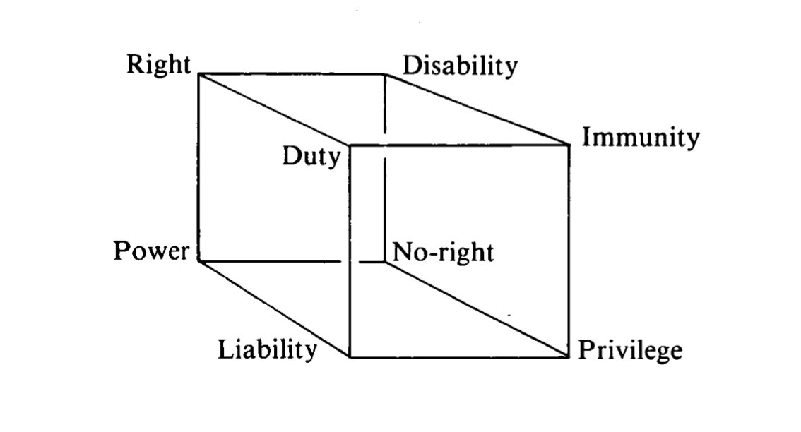

# Normative Positions

Normative frames are a specific type of object, representing Hohfeld’s framework of normative concepts[^1] which includes 8 notions, distributed on 2 squares, concerning respectively deontic (or duty-related) and potestative (or power-related) directives.

<figure markdown="span">
  { width="400" }
  <figcaption>Visualization of Hohfeld's framework for normative concepts</figcaption>
</figure>

Similarly to [eFLINT](https://gitlab.com/eflint), these concepts corresponds in DCPL to object-types with certain fixed parameters (frames, or stereotypical knowledge constructs).
Their instantiation, as that of any other object, can be conditioned by transformational or reactive [rules](rules.md).

## Power Frames

Powers specify an `action` and an optional `consequence` for that action, along with an optional `holder` of the power (i.e. the class of [agents](objects-and-events.md#agents) that may perform the `action`). A power frame can be of any of the following classes: `power`, `liability`, `disability`, and `immunity`; it has the following properties:

| property      | type                                                 | default     | description                                                |
| ------------- | ---------------------------------------------------- | ----------- | ---------------------------------------------------------- |
| `holder`      | [`agent`](../reference/objects-and-events.md#agents) | `*`         | the agent that detains the power                           |
| `action`      | [`event`](../reference/objects-and-events.md#events) | `undefined` | the action that the holder has power to perform            |
| `consequence` | [`directive`](../reference/objects-and-events.md)    | `undefined` | a directive that is triggered when the action is performed |

!!! example

    Agents that are `student` or `staff` can `#register` as `member` of the library by using their `id_card` (example of act creating a new [descriptor](objects-and-events.md#descriptors) qualification).

        power {
            holder: student | staff
            action: #register { instrument: holder.id_card }
            consequence: holder becomes member
        }

## Deontic Frames

A deontic frame is an object which can be of any of the following classes: `duty`, `prohibition`,`liberty`,`claim`,`protection`, `no_claim`; it has the following properties:

| property       | type                                                 | default     | description                                                         |
| -------------- | ---------------------------------------------------- | ----------- | ------------------------------------------------------------------- |
| `holder`       | [`agent`](../reference/objects-and-events.md#agents) | `*`         | the agent to which the duty applies                                 |
| `counterparty` | [`agent`](../reference/objects-and-events.md#agents) | `*`         | the agent which is interested in the fulfillment of the duty        |
| `action`       | [`event`](../reference/objects-and-events.md#events) | `undefined` | the action to perform in order to fulfill the duty                  |
| `violation`    | [`external_expression`](#external-expressions)       | `undefined` | an expression to evaluate that determines when the duty is violated |
| `termination`  | [`external_expression`](#external-expressions)       | `undefined` | an expression to evaluate that determines when the duty terminates  |

All objects are here referred through [descriptors](../reference/objects-and-events.md#descriptors), which can be complete or partial. The referring mechanism is similar to Cascading Style Sheets (CSS) in the sense that the refinement may reduce the number of objects to which the policy applies.

!!! example

    By borrowing, the borrower can be requested in any moment to return the item. The borrower has the duty to return the item within the given date. If the borrower does not return the item, they may be fined (example of composite object, with power, duty and violation constructs).

        duty {
            holder: borrower
            counterparty: lender
            action: #return { item: book }
            violation: now() > timeout
        }

[^1]: Hohfeld, W.N.: Fundamental legal conceptions as applied in judicial reasoning. Yale Law J. 26(8), 710–770 (1917)

## External Expressions

DCPL is not designed to be used as a traditional programming languages. Therefore, it lacks certain utilities, core-libraries, and expressions that can facilitate calculations or work with complex types.

The design of the language takes this into consideration by allowing the user to _hook_ into an external environment to perform complex calculations in order to check e.g. violation or termination conditions. An example of such environment could be a Python interpreter, which can execute an external expression such as:

```python
time.now() > duty_timeout
```

In principle, there is no limitation to what kind of interpreter could be leveraged to evaluate the expression, as the language design does not enforce any.

!!! todo

    At this stage of design, there is no formal definition for how these expressions should be evaluated, take specific arguments, rely on shared data etc.

    The reader should assume that an expression is meant to return a value computed externally in order for it to be used within a DCPL [directive](directives.md).
