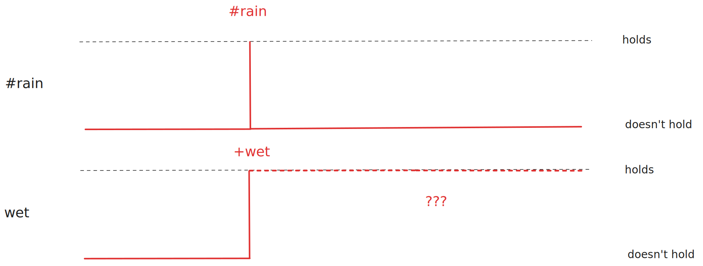

# Rules

DCPL considers the distinction of **transformational** and **reactive** rules, proceeding along LPS[^1].

## Transformational Rules

Transformational rules follow the template: `a -> b`, meaning that if `a` holds, then `b` holds too. Interpreting the “if” as “as long as”, the transformation aspect (of `a` into `b`, where both are [objects](objects-and-events.md#objects)) becomes explicit.

!!! quote

    A transformational system accepts inputs, performs transformations on them and produces outputs.[^2]

With this construct, we can incrementally determine the transformation of certain states. For instance, in the following snippet we **declare** that as long as the state `raining` is active, we can assume that the state `wet` is also active.

```
raining => wet
```

If we project the activation of different states on a timeline, we observe that they exist toghether.

<figure markdown="span">
  { width="75%" }
  <figcaption>Timeline visualization of activation for different state objects.</figcaption>
</figure>

!!! note

    Multiple transformational rules can affect the same state, increasing the opportunities for its activation and cooperating to transform it.

This is especially helpful when we are trying to model how context affects [agents](objects-and-events.md#agents)' capabilities.

!!! example

    Raising one's hand is considered a bid only while there is an ongoing auction:

    ```
    auction -> {
        #raise_hand => +bid
    }
    ```

## Reactive Rules

Reactive rules in DCPL are in the form: `#f => G`, meaning that the occurrence of a `#f` [event](objects-and-events.md#event) triggers another `G` [event](objects-and-events.md#event) of any type. This allows us to synchronize with external events and define an **imperative** control-flow.

!!! quote

    A reactive system, in general, does not compute or perform a function, but is supposed to maintain a certain ongoing relationship [...] with its environment.[^2]

Causal effects become explicit with production [events](objects-and-events.md#event). For instance, in the following snippet we activate the state `wet` given an action `#rain` is performed:

```
#rain => +wet
```

If we project the activation of different states on a timeline, we observe that when the original event `#rain` is fired (instantaneous activation), we get an activation of `wet`. However, we can make no further assumptions on the activation of `wet` in the future.

<figure markdown="span">
  { width="75%" }
  <figcaption>Timeline visualization of activation for a state object and an event.</figcaption>
</figure>

!!! example

    If you smoke here, you have to pay a fine:

    ```
    #smoke { smoker } => +duty {
        holder: smoker
        action: #pay
    }
    ```

[^1]: Kowalski, R., Sadri, F.: _A logic-based framework for reactive systems_. In: International Workshop on Rules and Rule Markup Languages for the Semantic Web. pp. 1–15. Springer (2012)
[^2]: Harel, D., & Pnueli, A. (1985). On the development of reactive systems. Logics and Models of Concurrent Systems, 477–498.
